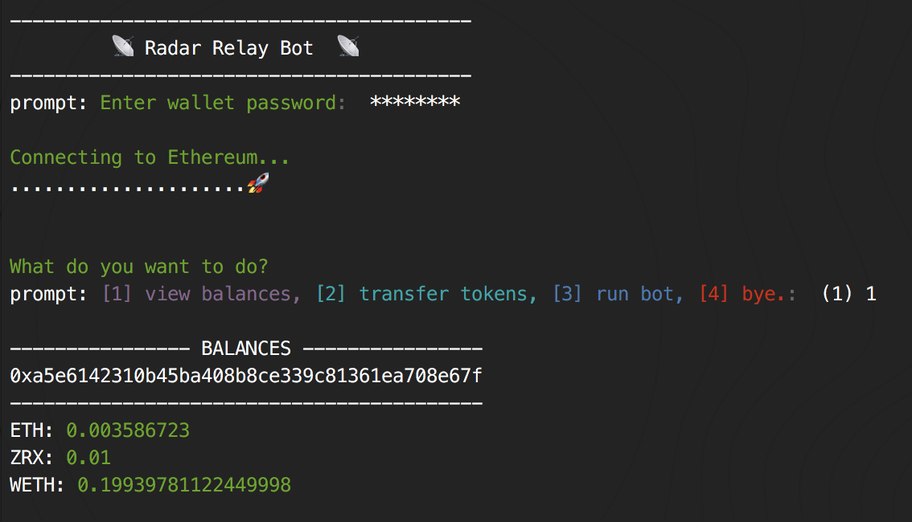

# Radar Relay Bot

The Radar Relay Bot is a simple CLI framework that can be utilized to create algorithmic trading bots and automated trading strategies for use with the Radar Relay API.

## Usage

1. [Install node](https://nodejs.org/en/download/)
2. `$ git clone git@github.com:RadarRelay/bot.git`
2. `$ cd ~/path/to/bot`
3. `$ cp example.config.yml config.yml`
4. `$ npm install`
5. `$ npm run build`
6. `$ radarbot`

## Contributing

To learn how to contribute or add an additional algorithmic trading strategy see: [CONTRIBUTING.md](CONTRIBUTING.md)

